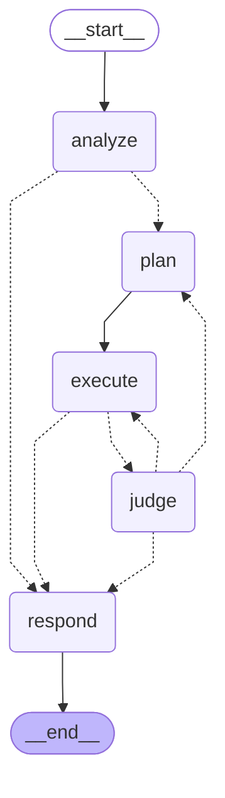

# LangGraph 구조 (명세 4.2)

`build_graph().get_graph().draw_mermaid()` 출력

```mermaid
---
config:
  flowchart:
    curve: linear
---
graph TD;
	__start__([<p>__start__</p>]):::first
	analyze(analyze)
	plan(plan)
	execute(execute)
	judge(judge)
	respond(respond)
	__end__([<p>__end__</p>]):::last
	__start__ --> analyze;
	analyze -.-> plan;
	analyze -.-> respond;
	execute -.-> judge;
	execute -.-> respond;
	judge -.-> execute;
	judge -.-> plan;
	judge -.-> respond;
	plan --> execute;
	respond --> __end__;
	classDef default fill:#f2f0ff,line-height:1.2
	classDef first fill-opacity:0
	classDef last fill:#bfb6fc

```
